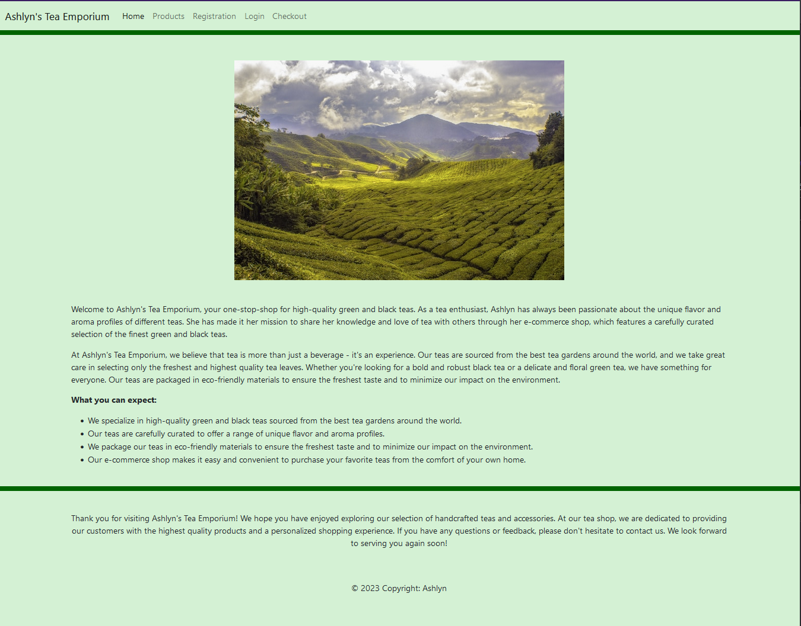
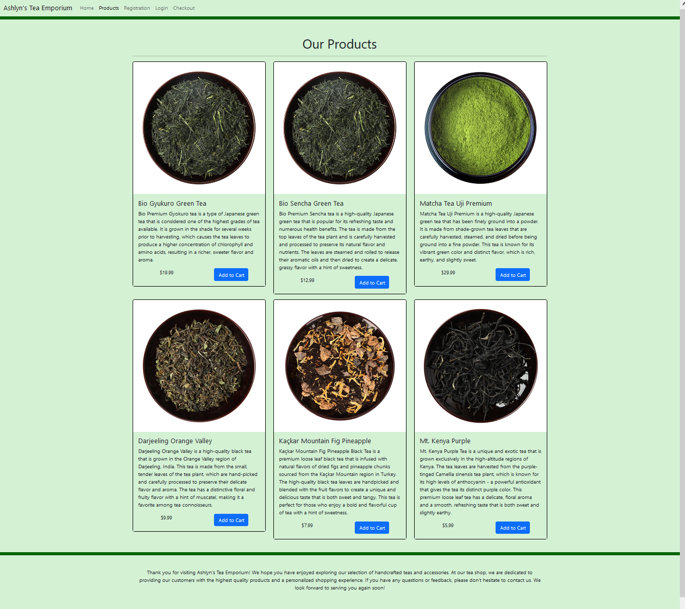
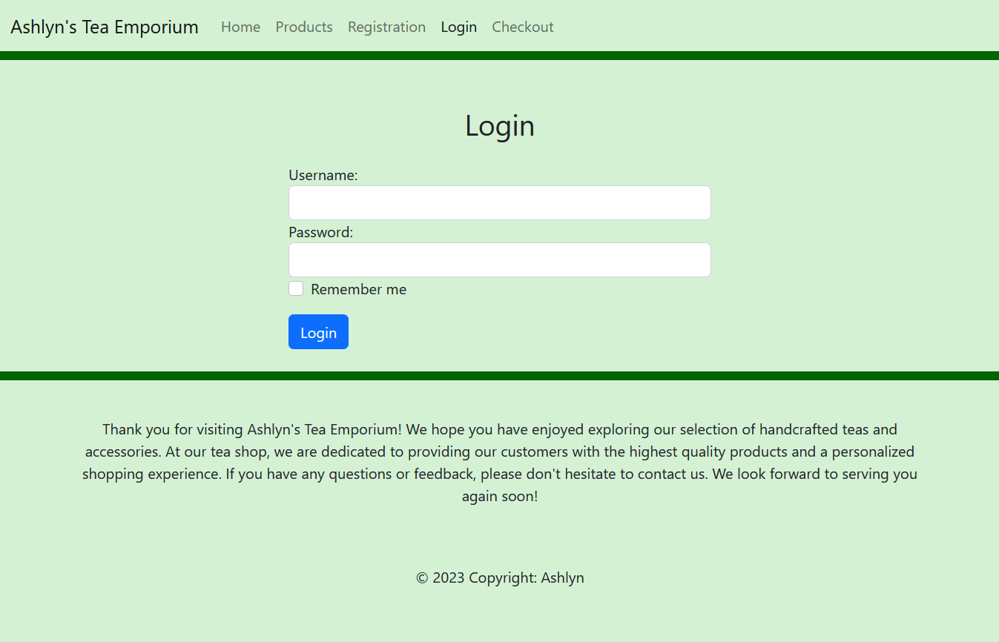
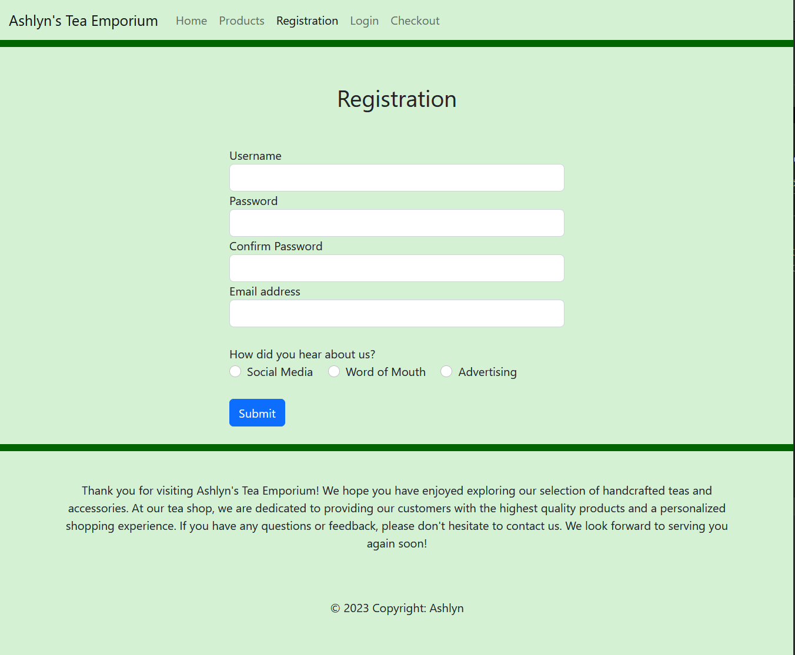

# Ashley's E-Commerce Project

This is an e-commerce project created by Ashley Sanchez using HTML, CSS, and Bootstrap. The project consists of 5 pages: an introduction page, a products page, a checkout page, a login page, and a registration page.

## Technologies Used

* HTML
* CSS
* Bootstrap

## Pages

1. Introduction Page: This is the landing page of the e-commerce website. It features a brief description of the website.



2. Products Page: This page displays a collection of products available for purchase. Each product is showcased with an image, title, description, price, and an "Add to Cart" button.



3. Checkout Page: This page allows users to review the items in their cart and proceed with the checkout process. Until now the cart are placeholder items. Users can enter their shipping information and complete the purchase.


4. Login Page: This page provides a login form for users to enter their credentials and access their account.



5. Registration Page: This page allows new users to register for an account by providing their personal information, such as name, email, and password. Users can then use their registered credentials to log in to the website.



## Interesting code

It is hard to say what code counts as interesting, but I've prepared two pieces of code where I needed some time to figure out a proper solution:

1. Adding a divider (the darkgreen line) to divide header and body. 
At first I had troubles finding a solution because everytime I added a margin to either the last element of the header or the first element of the body, the background-color of that margin was white instead of lightgreen. Also using the <hr> element to display a horizontal line didn't work out. 

I've found a solution: Creating an empty div-container of the class "border-darkgreen" and "divider" and styling these dividers in css to create the styling I needed.

```
 <!-- Div container to add the border at the top-->
        <div class="border-darkgreen"></div>

        <!-- container to add marging to the top and botton with css-->
        <div class="divider"></div>
```

and in the css-file:

```
.border-darkgreen{
    border-top: 10px solid darkgreen !important;
}

.divider{
    margin-top: 50px;
    margin-bottom: 20px;
}
```

2. The second problem I've run into is displaying the price of product in the proudcts-card on the same line as the button "Add to cart". The solution was to use a 2-column bootstrap-layout inside the products-card.

```
<div class="card">
    
    <div class="card-body">
        <h5 class="card-title">Bio Gyukuro Green Tea</h5>
        <p class="card-text">Paragraph Text</p>
        <div class="row">
            <div class="col-6 text-center">
                <p class="card-text">$19.99</p>
            </div>
            <div class="col-6 text-center">
                <a href="#" class="btn btn-primary">Add to Cart</a>
            </div>
        </div>
    </div>
</div>
```